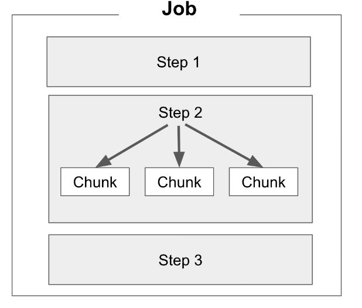
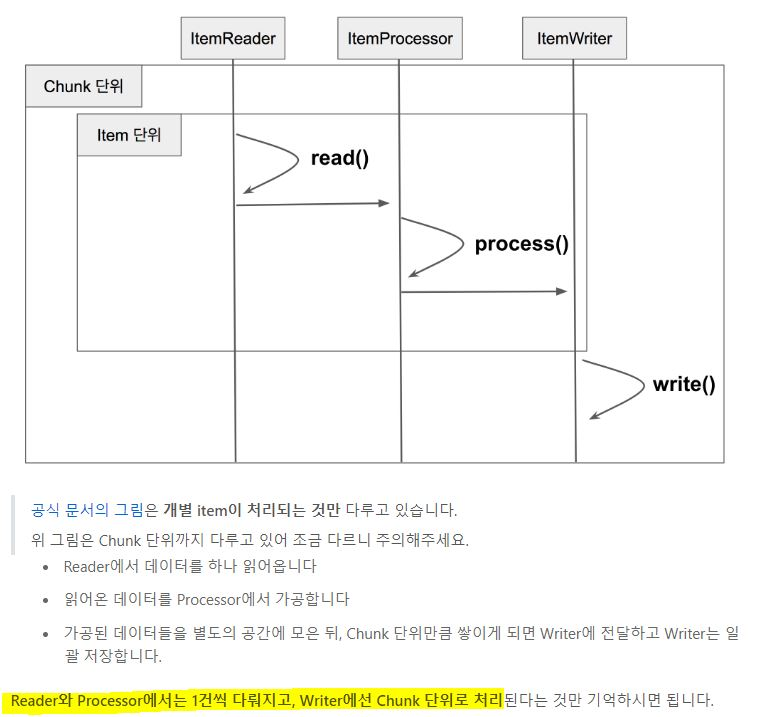
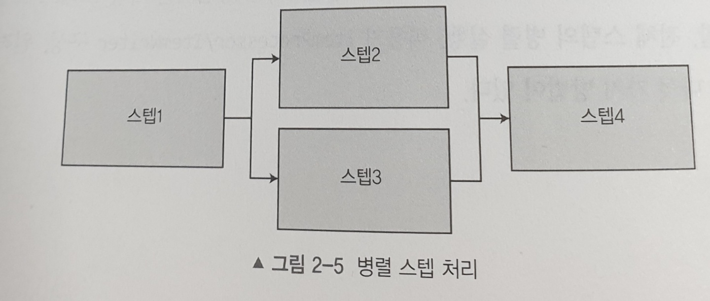
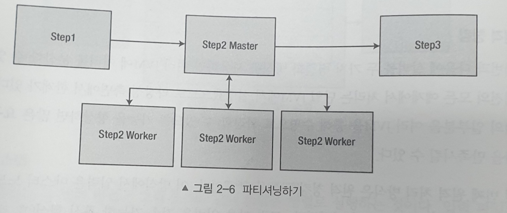

# Chapter 02. 스프링 배치

배치 아키텍처 설명 &  
프로젝트 초기 구성 후 Hello, World! 출력하는 간단 배치 프로그램을 작성해보는 실습 예제를 포함

### 배치 아키텍처
- 애플리케이션 레이어는 개발자가 개발한 코드로 대부분 코어 레이어와 상호작용
- 인프라스트럭처 레이어는 ItemReader 및 ItemWriter, 재시작 관련 문제를 해결할 수 있는 클래스와 인터페이스를 제공
#### 잡과 스텝
- 잡 : 상태 기계, 상태를 보여주는 단위가 스텝
- 스텝 : 독립된 작업의 단위
  - 태스크릿 기반 : 더 간단함.  초기화, 저장 프로시저 실행, 알림 전송 같은 잡에서 사용
  - 청크 기반 : 아이템 기반의 처리에 사용. ItemReader, ItemProcessor, ItemWriter 3개로 구성
#### 잡 실행
- JobRepository : 다양한 배치 수행과 관련된 수치 데이터, 잡의 상태 유지관리, 일반적으로 RDB 사용
- JobLauncher : 잡 실행 역할 담당, 재실행 가능여부 검증, 잡 실행 방법, 파라미터 유효성 검증 처리 수행
- Step에서 각 청크 처리가 완료될 때마다 Step Execution이 업데이트 됨.  
(현재까지의 커밋 수, 시작 및 종료시간, 기타 다른 정보 등이 Job Repository에 저장됨)
- Job -> JobInstance(논리적 실행) -> JobExecution(잡의 실제 실행)  
Job 파라미터가 달라지면 새로운 JobInstance 생성, 잡이 실패해서 동일한 조건으로 다시 실행하면 JobExecution만 생성
- StepExecution : Step의 실제 실행, StepInstance는 존재하지 않음
#### 병렬화
- 다중 스레드 스텝
  - 
  - Step은 chunk 단위로 처리됨
  - 10,000개의 레코드의 커밋 수를 50개로 설정, 1~50 처리 후 커밋 / 51~100 처리 후 커밋 등등의 작업을 병렬로 처리
  - 이 때, 병렬로 처리하는 것은 스레드
  - 참조,, chunk 기반 처리?
    - 
- 병렬 스텝
  - 
  - 서로 관련이 없는 step은 각 step을 기다릴 이유가 없으므로 병렬로 처리
- 비동기 ItemProcessor / ItemWriter
  - ItemReader가 제공해주는 데이터를 가공하는 데 복잡한 수식을 사용하거나 원격 서비스 호출하는 경우, 일부 스텝을 병렬화
  - AsynchronousItemProcessor는 Future를 반환하고 이것이 AsynchronousItemWriter에 전달됨
  - AsynchronousItemWriter는 ItemWriter의 데코레이터로, Future로 결과를 얻어낸 후 ItemWriter에 결과를 전달
- 원격 청킹
  - 스레드가 아니라 여러 JVM으로 확장
  - ItemReader로 마스터 노드에서 입력을 받고 래빗MQ나 액티브MQ와 같은 메시지 브로커를 통해 ItemProcessor로 전송됨
  - 처리가 완료되면 아이템을 다시 마스터로 보내거나 직접 기록하므로 네트워크 사용량이 매우 많아질 수 있음
  - I/O 비용이 적은 시나리오에 적합
- 파티셔닝
  - 
  - 원격 청킹에 비해 내구성 있는 통신 방법(메시지 브로커들)이 필요하지 않음
  - 잡 대신 마스터 노드로부터 일을 전달받음. 워커의 스텝은 독립적으로 동작,  
  모든 워커가 작업을 완료하면 마스터 스텝이 완료된 것으로 간주
  - JobRepository가 복제된 작업이 없고 모든 작업이 완료됐음을 보장하므로 지속적인 통신이 필요 없음
#### 프로젝트 실습
  - 기본 추가 dependency : Batch, H2, JDBC
  - "Hello, World!" 출력하는 간단한 batch job 예제 실습 후 실행
  - @EnableBatchProcessing : JobRepository, JobLauncher, JobExplorer, JobRegistry,  
PlatformTransactionManager, JobBuilderFactory, StepBuilderFactory 자동 등록
  - application 실행 -> JobLauncherCommandLineRunner에 의해 spring에 정의된 모든 Job 실행