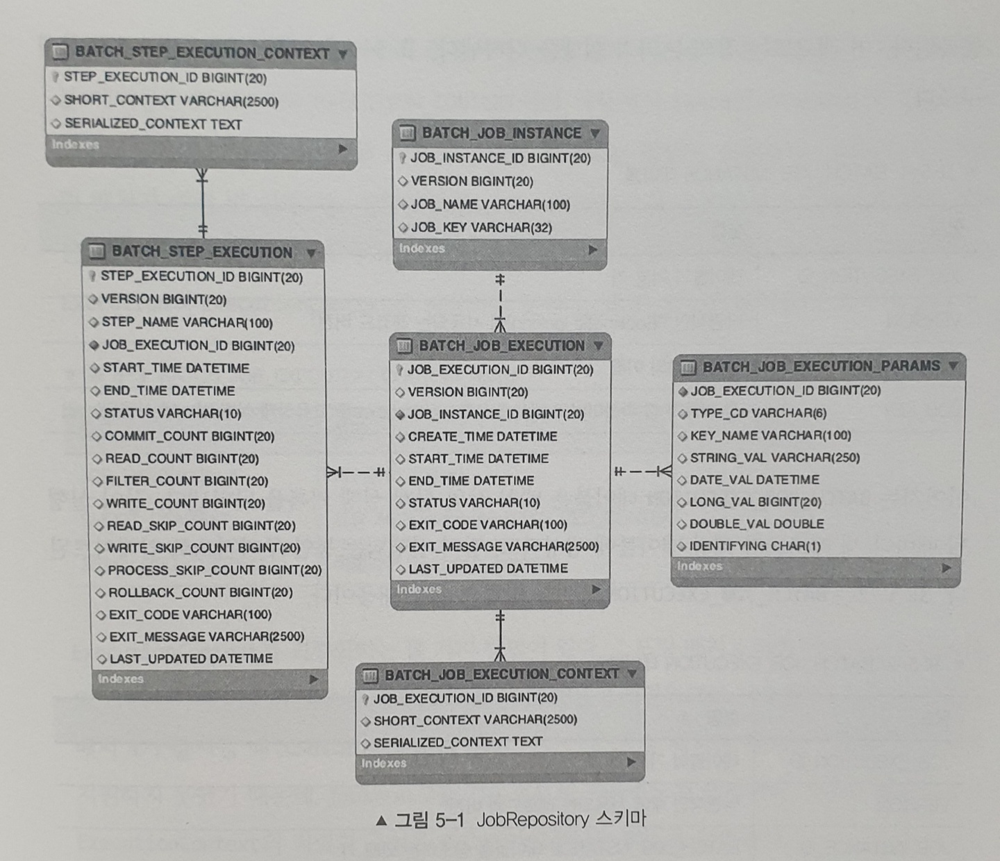

# Chapter 05. JobRepository와 메타데이터

스프링 배치는 잡 실행 중 오류 복구, 다시 잡을 재개하면 어떻게 되는지 등의 상태 관리 제공하는데  
이때 사용되는 것이 JobRepository  
상태관리 뿐만 아니라 모니터링 영역에도 유용함

## JobRepository란?
- JobRepository 인터페이스
- JobRepository 인터페이스 구현체가 사용하는 데이터 저장소
  - 인메모리 저장소
  - 관계형 데이터베이스 저장소

### 관계형 데이터베이스 사용하기
스프링 배치에서 기본적으로 사용되는 JobRepository, 배치 메타데이터를 저장하는 6개의 테이블  

- 시작점, BATCH_JOB_INSTANCE
  - 잡 파라미터로 잡 식별, 잡의 논리적 실행
- BATCH_JOB_EXECUTION
  - 잡의 실제 실행 기록
  - 실행 될 때마다 새로운 레코드에 기록되고 잡이 진행되는 동안 주기적으로 업데이트 됨
- BATCH_JOB_EXECUTION_CONTEXT
  - JobExecution의 ExecutionContext를 저장
- BATCH_JOB_EXECUTION_PARAMS
  - 잡이 매번 실행될 때마다 사용된 잡 파라미터 저장
- BATCH_STEP_EXECUTION
  - 스텝의 시작, 완료, 상태에 대한 메타데이터 저장
  - 읽기 횟수, 처리 횟수, 쓰기 횟수, 건너뛰기 횟수 데이터도 추가로 저장
- BATCH_STEP_EXECUTION_CONTEXT
  - StepExecution의 ExecutionContext 저장
  - 스텝 수준에서 ItemReader, ItemWriter와 같은 컴포넌트의 상태를 저장하는 데 사용

### 인메모리 JobRepository
- 배치 잡을 개발하거나 단위 테스트 수행할 때 사용
- Map 객체를 데이터 저장소로 사용하는 JobRepository 구현체 제공
  - 운영 시에는 H2 또는 HSQLDB와 같은 인메모리 db 사용할 것(멀티 스레딩 및 트랜잭션 기능 지원)

## 배치 인프라스트럭처 구성하기
- @EnableBatchProcessing 애너테이션 사용 시 추가 구성 없이 스프링 배치가 제공하는 JobRepository 사용
- 커스터 마이징이 필요할 때? -> BatchConfigurer 인터페이스 사용!

### BatchConfigurer 인터페이스
- 배치 인프라스트럭처 컴포넌트의 구성을 커스터마이징 하는 데 사용되는 전략 인터페이스
- 배치 관련 빈 등록되는 과정
  1. BatchConfigurer 구현체에서 빈 생성
  2. SimpleBatchConfiguration에서 스프링 ApplicationContext에 생성한 빈 등록
  - 보통 (i) 과정에서 커스터마이징 진행
- JobRepository, PlatformTransactionManager, JobLauncher, JobExplorer 커스터마이징 가능
- DefaultBatchCongigurer에는 기본 옵션이 제공되고 있으므로 이를 상속하여 필요한 메서드만 재정의 하는 방식이 좋음

### JobRepository 커스터마이징하기
- JobRepositoryFactoryBean을 통해 생성
  - DefaultBatchConfigurer의 createJobRepository 메서드 재정의
- 데이터베이스 유형, 테이블 접두어, DB 데이터 생성 시 트랜잭션 격리 레벨, 데이터 소스 변경 가능

### TransactionManager 커스터마이징하기
- DefaultBatchConfigurer의 getTransactionManager 메서드로 어딘가에 정의해둔 PlatformTransactionManager 명시적 반환
- 오버라이드하지 않는 이유?
  - TransactionManager가 생성되지 않은 경우 DefaultBatchConfigurer가 setDataSource에서 DataSourceTransactionManager를 자동 생성하도록 되어 있음

### JobExplorer 커스터마이징하기
- JobExplorer는 배치의 메타 데이터를 읽기 전용으로 제공(JobRepository는 잡의 상태를 저장/조회 가능하다는 면에서 차이 존재)
  - 커스터마이징 시 데이터를 읽어들이는 데 사용되는 애트리뷰트들이 JobRepository와 동일
  - dataSource, serializer, 테이블 접두어 등 커스터마이징 가능
  - JobRepository와 JobExplorer는 동일한 데이터 저장소를 사용하므로 둘 다 모두 커스터마이징 하는 것이 좋음
- spring container에 직접 노출되지 않으므로 InitializerBean.afterPropertiesSet() 및 FactoryBean.getObject() 호출 필요

### JobLauncher 커스터마이징하기
- JobLauncher는 잡을 실행하는 진입점
  - 기본 : SimpleJobLauncher 사용
  - Controller를 통해 잡을 실행하려 할 때 SimpleJobLauncher의 동작 방식을 조정할 필요성 있음
    - setJobRepository, setTaskExecutor를 통해 커스터마이징

### 데이터베이스 구성하기
- application.yml 또는 application.properties 파일로 데이터베이스 구성
- spring.batch.initialize-schema
  - always : 애플리케이션 실행 시마다 스크립트 실행, 개발 환경에 가장 쉬운 옵션
  - never : 스크립트 실행하지 않음
  - embedded : 실행 시마다 데이터가 초기화된 데이터베이스 인스턴스를 사용

## 잡 메타데이터 사용하기
- 스프링 배치는 내부적으로 여러 DAO로 JobRepository 테이블에 접근하나, 실용적인 API 제공하기도 함
  - 주된 방법 : JobExplorer 사용하는 것

### JobExplorer
- JobExplorer 인터페이스는 JobRepository의 이력 데이터나 최신 데이터에 접근하는 시작점
- 다른 컴포넌크들이 JobRepository로 DB에 접근하는 반면 JobExplorer는 DB에 직접 접근, 읽기 전용이므로 안전하게 접근 가능
- JobInstance와 JobExecution 관련 정보를 얻을 수 있는 7가지 메서드 제공
  - findRunningjobExecutions
  - findJobInstanceByName
  - getJobExecution / getJobExecutions
  - getJobInstance / getJobInstances : 현재의 JobInstance도 함께 반환된다는 것 알아두기
  - getJobInstanceCount
  - getJobNames
  - getStepExecution